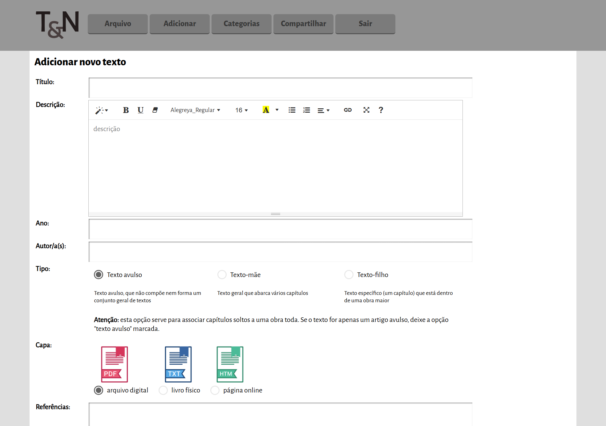
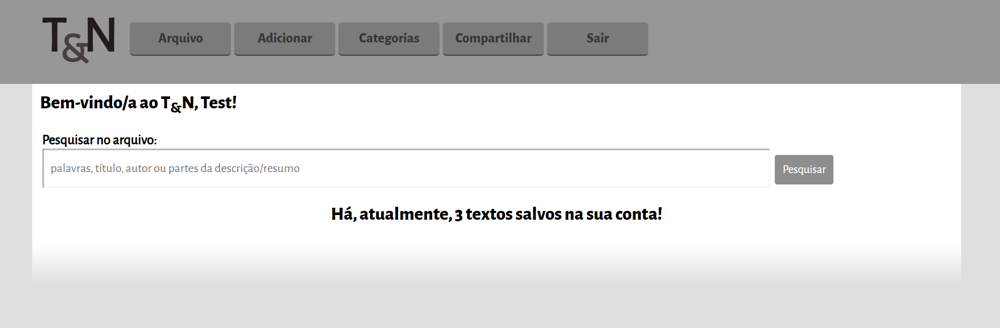
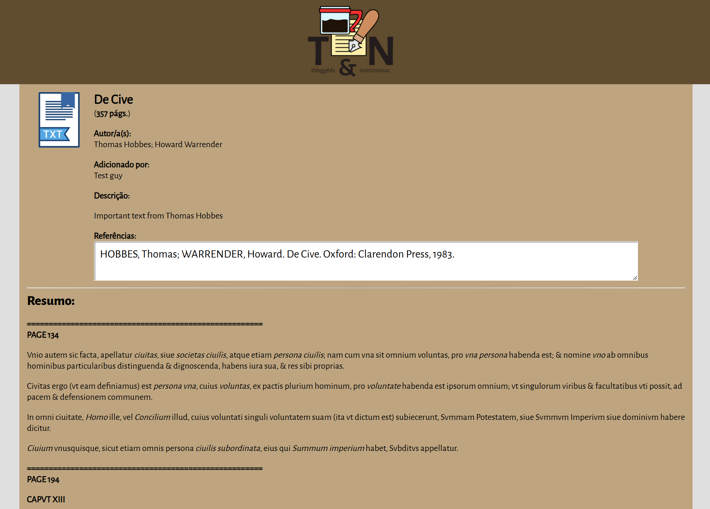
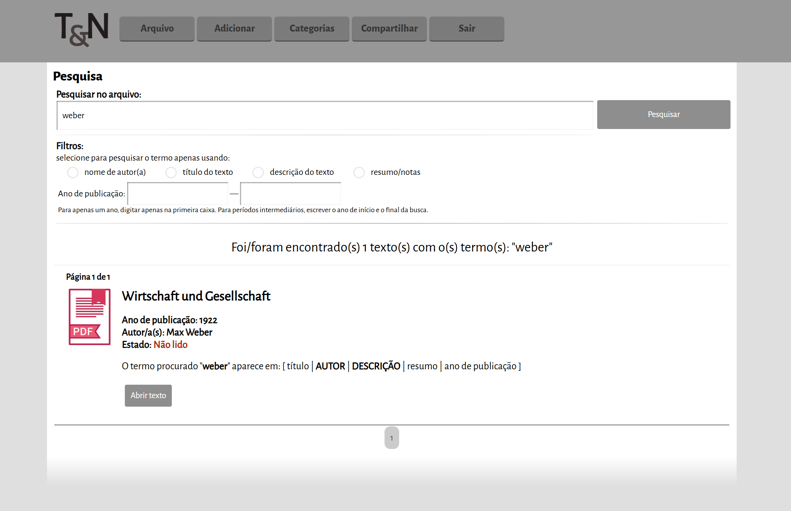
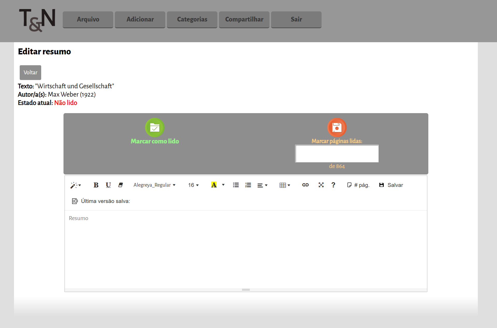
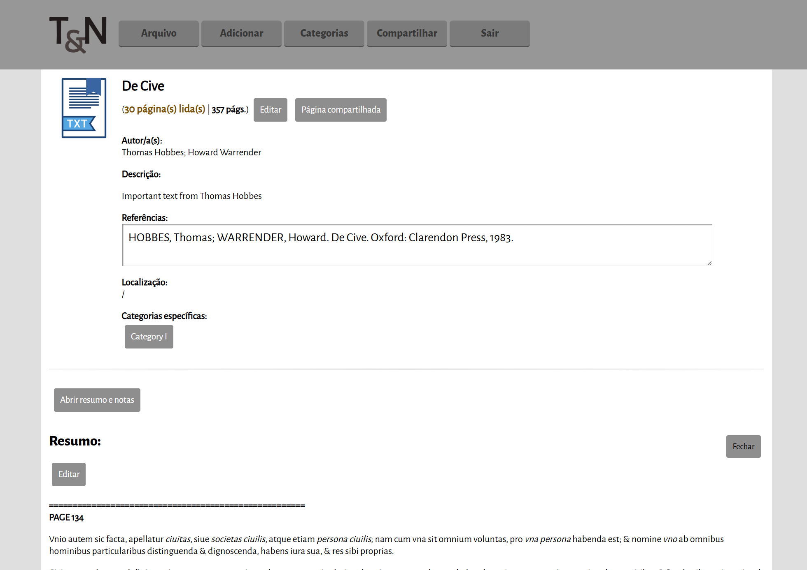

# T&N – Texts & Notes Management System

**Live demo:** [https://tedn.camk.net](https://tedn.camk.net)  
**Repository:** Showcase only (for the moment). Registration is also currently disabled (to try the system, enter username "test" and password "test").

---

## Overview

T&N is a **web system for managing scholarly texts and personal notes**. It helps users organise and track the texts they have read, create detailed summaries, and optionally share their notes with others.  

Created originally to track my reading during my bachelors. It is a system I keep using in my PhD. Designed for students, researchers, and knowledge enthusiasts in mind, T&N makes it easier to structure learning, revisit past readings, and share one's own insights with others.

---

## Key Features

- 🗂 **Text management** – Keep a catalog of scholarly texts you’ve read or plan to read.  
- 📝 **Notes & summaries** – Create structured notes for each text, including summaries and key insights.  
- 👥 **Sharing** – Optionally share notes with other users, promoting collaborative learning.  
- 📊 **Progress tracking** – Track reading history and revisit notes easily. 

---

## Technologies Used

- **Frontend:** HTML, CSS  
- **Backend:** PHP  
- **Database:** MySQL  

---

## Screenshots

## Screenshots

<table>
  <tr>
    <td align="center">
       
      Add a new text in create mode
    </td>
    <td align="center">
       
      Main dashboard showing the number of texts added to the account
    </td>
    <td align="center">
       
      Share your notes with other users (page in older style)
    </td>
  </tr>
  <tr>
    <td align="center">
       
      Search through your texts and notes
    </td>
    <td align="center">
       
      Edit or add summaries for a text
    </td>
    <td align="center">
       
      View details and notes for a specific text
    </td>
  </tr>
</table>
